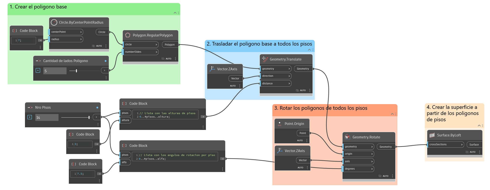
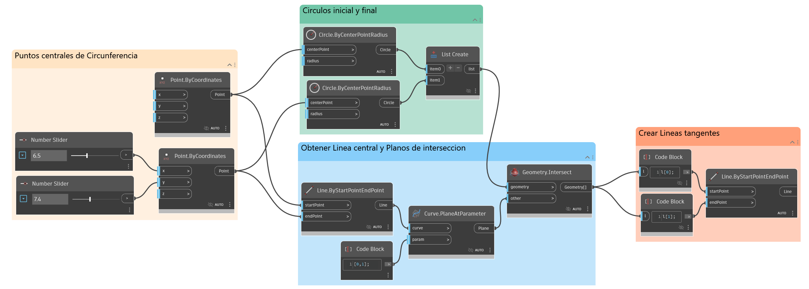

## Ejemplo 01: Edificio Torcido
El script que se busca programar con un Python Script es el siguiente:




```py
# Importación de bibliotecas
import clr

clr.AddReference('ProtoGeometry')
from Autodesk.DesignScript.Geometry import *

# Crear Polígono Base
punto = Point.ByCoordinates(0,0,0)
circulo = Circle.ByCenterPointRadius(punto, 7)
poligonoBase = Polygon.RegularPolygon(circulo, 5)

# Definiendo parámetros base
alturaPiso = 3.5
anguloRota = 15
cantidadPisos = 14
#vecZ = Vector.ByCoordinates(0,0,1)
vecZ = Vector.ZAxis()
# Inicializamos una lista "listaPoligonos"
listaPoligonos = []
# Iteramos la cantidad de pisos
for piso in range(cantidadPisos): #[0, 1, 2, 3 ... cantidadPisos-1]
    alturaAcumulada = alturaPiso * piso
    anguloRotaAcumulada = anguloRota * piso
    # Trasladamos el polígono
    poliTrasladado = poligonoBase.Translate(vecZ, alturaAcumulada)
    # Rotamos ese polígono ya trasladado
    poliRotadoTraladado = poliTrasladado.Rotate(punto, vecZ, anguloRotaAcumulada)
    # Lo almacenamos en la lista "listaPoligonos"
    listaPoligonos.append(poliRotadoTraladado)

# Crear la superficie a partir de los polígonos de pisos
surf = Surface.ByLoft(listaPoligonos)

OUT = surf
```

## Ejemplo 02: Brazo Paramétrico





