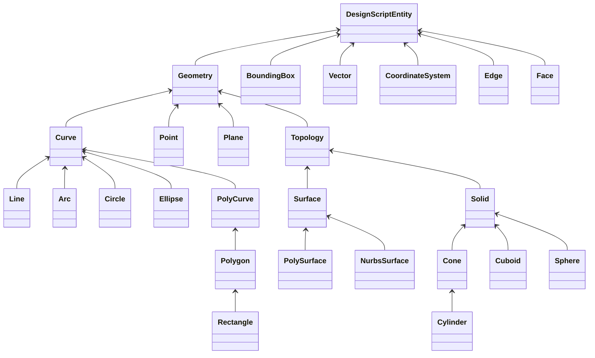

# 3. Objetos Geometricos
Como pudimos observar en las secciones anteriores, la geometria de Dynamo se crea usando losnodos.
El resultado que devuelve un nodo de geometria es un objeto el cual ya sabemos reconocer, perotambein es importantes
tener en cuenta que existe un diagrma de clases el cual debemos reconocer para poder usar adecuadamente los nodos 
geometricos.

