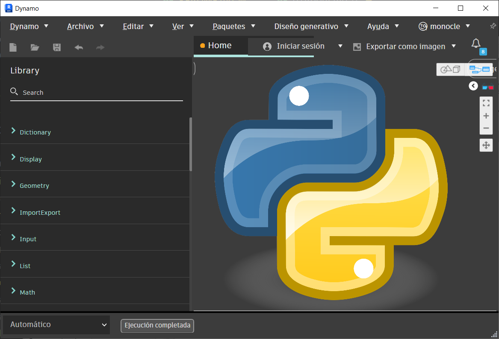

# 1. Lenguaje de Programación Python

Python es un lenguaje de programación de alto nivel, interpretado, de propósito general y de
código abierto. Fue creado por Guido van Rossum y lanzado por primera vez en 1991. 

Python se destaca por su legibilidad y sintaxis clara, lo que lo hace ideal tanto para principiantes como para
programadores experimentados. Además, cuenta con una amplia comunidad y una gran cantidad
de bibliotecas y módulos que facilitan el desarrollo de aplicaciones y proyectos.

Aunque Dynamo admite varios lenguajes de programación, Python también es uno de los lenguajes
que se pueden utilizar en los nodos de Dynamo. Esto brinda a los usuarios la flexibilidad de usar
Python para escribir scripts más complejos cuando los nodos predeterminados no son suficientes.

Python como lenguaje de programación nos permite desarrollar algoritmos a través de la API de
Revit, y esto se puede hacer desde Dynamo o incluso otras herramientas como PyRevit, que es
un complemento de Revit que permite insertar funcionalidades personalizadas

