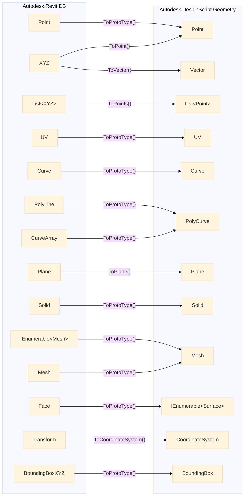
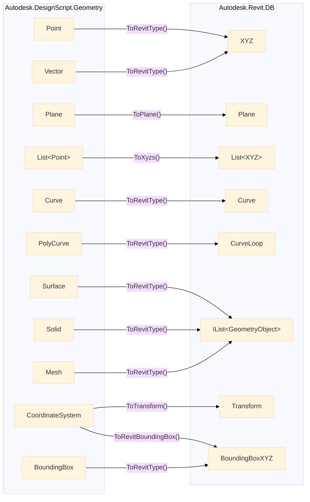

# 3. Objetos Dynamo Revit

## 3.1. Elementos de Revit Empaquetados
Cuando se interactúa con la API de Revit dentro de Dynamo, los elementos de Revit están "envueltos" 
en una capa de Dynamo que permite su manipulación en el entorno visual. Para utilizar estos elementos 
en métodos que requieren el acceso completo a la API de Revit, es necesario "desenvolverlos" y trabajar 
directamente con ellos como objetos de Revit.

En el siguiente codigo se muestra como se usa la funcion `UnwrapElement()`:
```python title="PythonScript 📦"
# elemento_D es un elemento proveniente del entorno de Dynamo
elemento_D = IN[0]                      # Revit.Elements.Element
elemento_R = UnwrapElement(elemento_D)  # Autodesk.Revit.DB.Element

# Ahora se puede acceder a propieades y métodos establecidos en la documentación de Revit
estaBloqueado = elemento_R.Pinned

OUT = estaBloqueado
```

:::caution[Cuidado!]

El empaquetamiento de elemento **solo ocurre en Dynamo**, en PyRevit no hay necesidad de hacer tal cosa.
:::


## 3.2. Geometría de Dynamo y Revit (GeometryConversion) 
La biblioteca `GeometryConversion` en el contexto de Dynamo y la API de Revit es fundamental 
para convertir entre los tipos de geometría que se manejan en ambos entornos. Trabajar con 
geometrías es común cuando se realizan operaciones avanzadas, análisis o automatizaciones, 
y la compatibilidad entre Dynamo y Revit puede requerir conversiones específicas para que los datos fluyan de manera eficiente.

### 3.2.1. Metodos Extendidos para conversion de Revit a Dynamo



### 3.2.2. Metodos Extendidos para conversion de Dynamo a Revit

